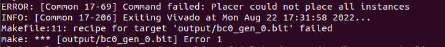
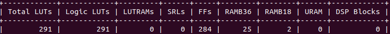
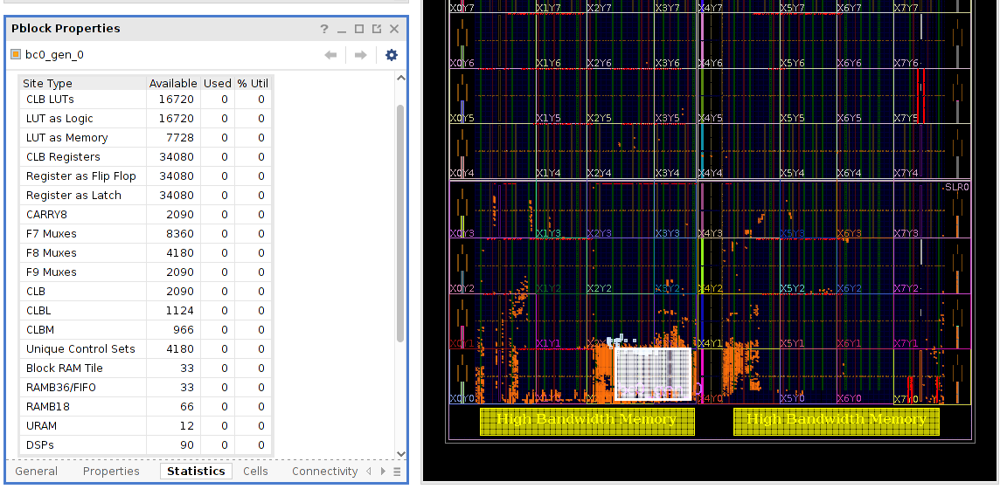
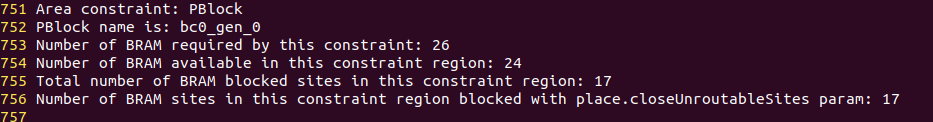

# abs_shell_bug_demo
This demo is to show the low resource utilization of [DFX](https://www.xilinx.com/content/dam/xilinx/support/documents/sw_manuals/xilinx2021_2/ug909-vivado-partial-reconfiguration.pdf) region for Xilinx FPGAs.

## Tutorial 
First, set up the environment variables for the Vitis Tool on you local machine by launching:
```
source /scratch/unsafe/Xilinx/Vitis/2021.1/settings64.sh
```
Next, execute `make all` as below. The Makefile will autmatically: 1) compile the Verilog source files to a post-synthesis DCP; 2) place and route the post-synthesis DCP file within the abstract shell.

```
make all
```

Finally, you will see errors as below.



Open the `utilization.rpt` file, you can see the target page needs 26 BRAM36s as below.



Open the `input/abstract_shell/bc0_gen_0_overlay.dcp`, you can see the DFX region have 33 BRAM36s available.



Open the 'vivado.log', you can see 17 BRAM36s are blocked and only 24 BRAM36s are available to use.




